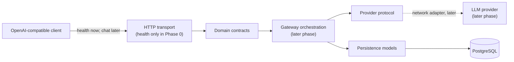

# LLM Gateway Architecture

## Phase 0 scope

Phase 0 defines contracts and durable boundaries without exposing chat
completion execution or calling an upstream provider. It runs an ASGI
application with `GET /health/live`, `GET /health/ready`, and generated OpenAPI
documentation. The future chat API shape is a narrow, non-streaming subset of
`POST /v1/chat/completions`.

Supported request concepts:

- `model`
- text-only `messages` using `developer`, `system`, `user`, `assistant`, and
  `tool` roles
- common sampling controls, stop sequences, seed, and token limits

Supported response concepts:

- `id`, `object="chat.completion"`, `created`, and `model`
- `choices` containing a text message and finish reason
- prompt, completion, and total token usage
- OpenAI-style `{ "error": { "message", "type", "param", "code" } }`

Streaming, multimodal content, tool definitions/calls, provider networking,
chat endpoint execution, authentication, and routing policy are outside Phase
0. `POST /v1/chat/completions` returns `404` until a later phase registers the
route.

## System context

Dashed flow indicates an upstream adapter that is intentionally not
implemented in Phase 0.

## Phase 0 HTTP surface

- `GET /health/live` confirms the application process can serve requests.
- `GET /health/ready` confirms application configuration loaded successfully.
- `GET /openapi.json` exposes only registered Phase 0 routes.
- `/v1` is reserved for versioned APIs, but no chat completion route is
  registered.

## Package boundaries

`llm_gateway.domain`
: Transport-neutral Pydantic contracts for chat completion requests,
responses, usage, and API errors. This package must not import HTTP,
persistence, or concrete provider code.

`llm_gateway.providers`
: Typed asynchronous provider boundary, provider error taxonomy, and an
in-memory scripted test double. Concrete provider adapters may depend on the
domain package but must not expose provider SDK types to callers.

`llm_gateway.persistence`
: SQLAlchemy 2 metadata and relational entities. ORM objects are persistence
records, not API contracts, and must not be returned directly from transport
code.

Future transport and application packages may depend on all three packages.
Dependencies must not point back from these packages into transport or
application composition.

## Request lifecycle

1. The transport layer accepts a non-streaming chat completion request.
2. It validates the payload into `ChatCompletionRequest`.
3. It accepts or generates a correlation ID and creates a distinct immutable
   gateway request ID.
4. Orchestration resolves the gateway model to an enabled provider model.
5. A `gateway_requests` row records lifecycle state and a redacted payload only
   when policy permits.
6. Each provider invocation creates a `provider_attempts` row before work
   begins, then records success or a normalized provider error.
7. Successful provider output is normalized into `ChatCompletionResponse`.
8. Token counts are recorded in `usage_records`; audit-safe request context is
   recorded separately in `audit_metadata`.
9. The transport returns either the normalized response or `ErrorResponse`.
10. Completion timestamps are written even when the request fails.

State changes should be monotonic:

`received -> in_progress -> succeeded | failed | cancelled`

Provider attempts use:

`pending -> in_progress -> succeeded | failed | timed_out | cancelled`

## Correlation and identity

- `gateway_request_id` is an internal UUID and primary trace key.
- `correlation_id` is an opaque, bounded string propagated across logs,
  persistence, and provider context. Generate one when a trusted inbound value
  is absent.
- Do not put prompts, user identifiers, API keys, email addresses, or model
  output in correlation IDs.
- Provider request IDs may be retained on provider attempts because they are
  operational identifiers, but they must be treated as confidential metadata.
- Logs should carry `correlation_id`, `gateway_request_id`, and
  `provider_attempt_id` as structured fields.

## Configuration policy

Configuration implementation belongs to a later phase. Its contract is:

- Environment variables or an external secret manager supply credentials.
- Persistent provider records may contain a secret reference, never a secret
  value.
- Startup validates required settings and fails closed.
- Provider timeouts, enabled state, model mappings, and privacy controls are
  explicit configuration, not implicit SDK defaults.
- Configuration values are never dumped wholesale to logs.
- Environment-specific values do not enter source control.

See [privacy.md](privacy.md) for data handling requirements.

## Persistence design

The initial schema represents:

- `providers`: provider identity and non-secret operational configuration
- `models`: gateway-to-provider model mapping and declared capabilities
- `gateway_requests`: request lifecycle and normalized error outcome
- `provider_attempts`: each attempted provider/model invocation
- `usage_records`: token accounting associated with a request and attempt
- `audit_metadata`: privacy-reduced actor and client context

Composite constraints preserve cross-row identity:

- an attempt's `(model_id, provider_id)` must identify one model mapping
- usage linked to an attempt must use the same `gateway_request_id`
- usage totals must equal prompt plus completion tokens

UUID primary keys, timezone-aware timestamps, constrained string lengths, and
JSON/JSONB-compatible columns keep the models PostgreSQL-ready while allowing
lightweight local metadata construction. Privacy-sensitive columns carry
database comments documenting allowed content and handling expectations.

## Alembic conventions

- Import `llm_gateway.persistence.Base.metadata` as Alembic target metadata.
- Use the naming convention defined in `persistence/metadata.py`; do not
  hand-name routine indexes or constraints unless the name communicates domain
  meaning.
- Generate a revision, inspect it, then edit it. Autogeneration is a draft.
- Use additive, backwards-compatible migrations for rolling deployments.
- Separate data backfills from long-running DDL when practical.
- Never autogenerate destructive column or table removal without an explicit
  ADR and rollback plan.
- PostgreSQL enum types are avoided in the initial models so lifecycle values
  can evolve through ordinary constrained application strings.
- The initial Phase 0 revision creates all six persistence tables and their
  integrity constraints. A clean `alembic upgrade head` must emit schema DDL.

## Error boundary

Provider adapters raise typed `ProviderError` subclasses. Orchestration maps
those failures into stable gateway error types and decides whether retry or
fallback is allowed. Provider exception strings and response bodies must not be
sent directly to clients because they can contain credentials, prompts, or
provider-specific internals.

## Decisions

Architecture decisions are recorded in [adr/README.md](adr/README.md).
