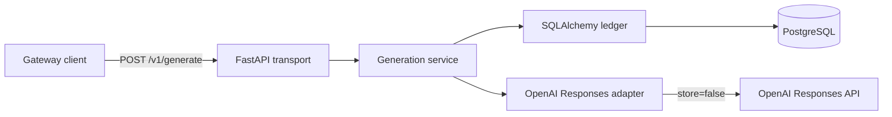

# LLM Gateway Architecture

## Phase 1 scope

Phase 1 delivers one non-streaming OpenAI-backed vertical slice:

- `GET /health/live`
- `GET /health/ready`
- `POST /v1/generate`
- normalized provider usage and errors
- exact `Decimal` cost calculation
- durable request, attempt, pricing, and usage records

Authentication, quotas, Redis caching, guardrails, retries, fallback, dynamic
routing, and additional providers are outside Phase 1. The earlier
chat-completion contracts remain transport-neutral foundations;
`/v1/chat/completions` is not registered.

## System context



## Public contract

`GenerateRequest` accepts a gateway model alias, text input, sampling controls,
and an output-token limit. It deliberately has no unauthenticated end-user
identity field. Phase 2 may derive provider safety identifiers from authenticated
actors without trusting a caller-supplied identity.

`GenerateResponse` returns:

- gateway request ID
- generated output
- selected provider and gateway model
- input, output, and total tokens
- estimated cost and currency
- routing reason
- provider cache hit or miss
- end-to-end latency

Provider SDK and persistence types never cross the public HTTP boundary.

## Request lifecycle

1. FastAPI validates the request and binds a safe correlation ID.
2. The service resolves the gateway model to the single configured
   provider/model mapping. There is no routing policy or fallback selection.
3. The ledger atomically creates the gateway request and first provider attempt
   as `in_progress` with one shared start timestamp.
4. The OpenAI adapter sends a Responses API request with `store=false`.
5. The adapter normalizes output, provider request ID, token usage, cached input
   tokens, and provider errors.
6. On success, one transaction selects the effective pricing snapshot, computes
   cost, inserts one usage record, and marks request and attempt succeeded.
7. On provider failure, one transaction records a sanitized terminal error and
   writes no usage.

Successful completion is valid only for the matching in-progress request and
attempt. A unique usage-to-attempt constraint prevents duplicate charging.

## Usage and pricing

Provider usage distinguishes:

- total input tokens
- cached input tokens
- output tokens
- total tokens

Uncached input is `input_tokens - cached_input_tokens`. Cost is:

```text
(uncached_input * input_rate
 + cached_input * cached_input_rate
 + output * output_rate) / 1_000_000
```

Every term uses `Decimal`, and the final amount is rounded to ten decimal
places. The usage row references the pricing snapshot used for the calculation.
Phase 1 defaults for `gpt-4.1-mini` are USD 0.40 input, USD 0.10 cached input,
and USD 1.60 output per million tokens.

## Package boundaries

`llm_gateway.domain`
: Public, transport-neutral request, response, token, cost, and error models.

`llm_gateway.providers`
: Async provider protocols, normalized provider usage, safe error taxonomy, and
the OpenAI Responses adapter.

`llm_gateway.persistence`
: SQLAlchemy entities, configured mapping bootstrap, lifecycle transactions,
pricing selection, and usage accounting.

`llm_gateway.services`
: Orchestration across configured model lookup, provider execution,
persistence, and public response construction.

`llm_gateway.api`
: FastAPI route composition only; it does not calculate cost or interpret
provider payloads.

## Privacy boundary

- Prompts and generated output are neither logged nor persisted.
- OpenAI requests set `store=false`.
- API keys come from environment injection and never enter database records.
- Provider response bodies and exception strings are not returned to clients or
stored as error messages.
- Correlation IDs are validated opaque operational identifiers.
- Provider request IDs are confidential operational metadata.

See [privacy.md](privacy.md) for the full handling policy.

## Migration policy

Alembic imports `llm_gateway.persistence.Base.metadata`. Published revisions are
immutable; Phase 1 repairs use an additive revision for cached-input pricing,
cached-token persistence, and usage uniqueness. A gate run must prove one head
and render the complete PostgreSQL upgrade SQL from an empty database.

## Decisions

Architecture decisions are recorded in [adr/README.md](adr/README.md).
