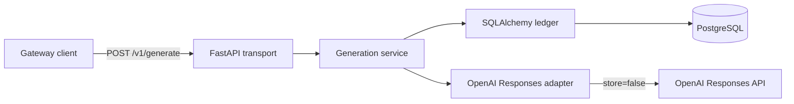

# LLM Gateway Architecture

## Phase 1 scope

Phase 1 delivers one non-streaming OpenAI-backed vertical slice:

- `GET /health/live`
- `GET /health/ready`
- `POST /v1/generate`
- normalized provider usage and errors
- exact `Decimal` cost calculation
- durable request, attempt, pricing, and usage records

Authentication, quotas, Redis caching, guardrails, retries, fallback, dynamic
routing, and additional providers are outside Phase 1. The earlier
chat-completion contracts remain transport-neutral foundations;
`/v1/chat/completions` is not registered.

## Phase 2 contract freeze

Phase 2 keeps the same `POST /v1/generate` request body and extends the gateway
around it. This section freezes the contracts that later implementation steps
must follow.

### Request path

The final runtime order for Phase 2 is:

1. authenticate the gateway API key
2. evaluate gateway guardrails
3. enforce per-actor quota
4. check the per-actor response cache
5. execute provider selection, retry, and fallback within one deadline
6. persist the terminal result

The build order may differ, but later implementation must preserve this runtime
order exactly.

### Authentication

- `POST /v1/generate` requires `Authorization: Bearer <gateway_api_key>`.
- The request body remains identical to Phase 1. Caller identity does not move
  into the JSON payload.
- A valid gateway API key resolves exactly one internal actor identity.
- Missing, unknown, or disabled keys must fail before guardrails, quota, cache,
  or provider execution.
- Authentication failures must be sanitized and must not create provider-attempt
  or usage rows.

### Actor and key registry

The actor/key registry must be able to express:

- key hash
- stable `actor_id`
- key enabled or disabled state
- quota policy
- optional provider-access policy

Raw API keys are runtime secrets and must never be persisted verbatim.

### Public response contract

Phase 2 adds metadata to the existing response shape without changing the
request body:

- `served_from_cache: bool`
- `attempt_count: int`
- `provider: str`

`provider` continues to report the terminal winning provider. Cached responses
must still report the provider that produced the cached result.

### Cache contract

- Cache scope is per actor.
- Cache key material is:
  `actor_id + normalized request fingerprint + resolved gateway model + guardrail_version`.
- Only successful normalized gateway responses may be cached.
- Blocked, failed, timed out, partial, or malformed upstream outcomes must not
  populate the cache.
- Cache entries must expire by TTL and must stop matching after a
  `guardrail_version` change.
- Cache storage must not expose raw prompt text, generated output, or secrets in
  keys or values.

### Guardrail contract

- Guardrails run before cache lookup and before any provider attempt.
- The only normalized outcomes are `allow` and `block`.
- A `block` result carries only a sanitized reason code.
- Blocked requests must produce zero provider calls, zero usage rows, and zero
  charges.
- Prompt or output text from blocked requests must not appear in logs,
  persistence, or Redis.

### Provider pool and retry contract

- The provider pool starts with primary `openai`.
- Ordered fallback providers are `anthropic`, then `gemini`.
- Retry policy allows at most one same-provider retry for retryable failures.
- All attempts share one absolute end-to-end deadline budget.
- Non-retryable failures must not trigger retry or fallback.
- Retry/fallback selection must respect any actor-level provider-access policy.

### Ledger invariants

- One gateway request may have multiple provider attempts.
- Every provider attempt gets its own attempt row in chronological order.
- Exactly one terminal winning attempt may produce one usage row and one charge.
- Failed, timed out, blocked, or abandoned attempts must never create usage.
- Reconciliation logic must preserve the single-charge invariant even if
  persistence becomes ambiguous after upstream success.

## System context



## Public contract

`GenerateRequest` accepts a gateway model alias, text input, sampling controls,
and an output-token limit. It deliberately has no unauthenticated end-user
identity field. Phase 2 may derive provider safety identifiers from authenticated
actors without trusting a caller-supplied identity.

`GenerateResponse` returns:

- gateway request ID
- generated output
- selected provider and gateway model
- input, output, and total tokens
- estimated cost and currency
- routing reason
- provider cache hit or miss
- whether the terminal response was served from cache
- how many provider attempts were used
- end-to-end latency

Provider SDK and persistence types never cross the public HTTP boundary.

## Request lifecycle

1. FastAPI validates the request and binds a safe correlation ID.
2. The service resolves the gateway model to the single configured
   provider/model mapping. There is no routing policy or fallback selection.
3. The ledger atomically creates the gateway request and first provider attempt
   as `in_progress` with one shared start timestamp.
4. The OpenAI adapter sends a Responses API request with `store=false`.
5. The adapter normalizes output, provider request ID, token usage, cached input
   tokens, and provider errors.
6. On success, one transaction selects the effective pricing snapshot, computes
   cost, inserts one usage record, and marks request and attempt succeeded.
7. On provider failure, one transaction records a sanitized terminal error and
   writes no usage.

Successful completion is valid only for the matching in-progress request and
attempt. A unique usage-to-attempt constraint prevents duplicate charging.

## Usage and pricing

Provider usage distinguishes:

- total input tokens
- cached input tokens
- output tokens
- total tokens

Uncached input is `input_tokens - cached_input_tokens`. Cost is:

```text
(uncached_input * input_rate
 + cached_input * cached_input_rate
 + output * output_rate) / 1_000_000
```

Every term uses `Decimal`, and the final amount is rounded to ten decimal
places. The usage row references the pricing snapshot used for the calculation.
Phase 1 defaults for `gpt-4.1-mini` are USD 0.40 input, USD 0.10 cached input,
and USD 1.60 output per million tokens.

## Package boundaries

`llm_gateway.domain`
: Public, transport-neutral request, response, token, cost, and error models.

`llm_gateway.providers`
: Async provider protocols, normalized provider usage, safe error taxonomy, and
the OpenAI Responses adapter.

`llm_gateway.persistence`
: SQLAlchemy entities, configured mapping bootstrap, lifecycle transactions,
pricing selection, and usage accounting.

The application ledger is synchronous and uses
`postgresql+psycopg://`. Bare `postgresql://` runtime URLs normalize to psycopg;
asyncpg runtime URLs fail configuration validation before engine construction.
Alembic is a separate process boundary and retains its asyncpg engine for
online migrations.

`llm_gateway.services`
: Orchestration across configured model lookup, provider execution,
persistence, and public response construction.

`llm_gateway.api`
: FastAPI route composition only; it does not calculate cost or interpret
provider payloads.

## Privacy boundary

- Prompts and generated output are neither logged nor persisted.
- OpenAI requests set `store=false`.
- API keys come from environment injection and never enter database records.
- Provider response bodies and exception strings are not returned to clients or
stored as error messages.
- Correlation IDs are validated opaque operational identifiers.
- Provider request IDs are confidential operational metadata.
- The packaged server disables Uvicorn raw access logs; gateway request logs
  use route templates and never include query strings.

See [privacy.md](privacy.md) for the full handling policy.

## Migration policy

Alembic imports `llm_gateway.persistence.Base.metadata`. Published revisions are
immutable; Phase 1 repairs use an additive revision for cached-input pricing,
cached-token persistence, and usage uniqueness. A gate run must prove one head
and render the complete PostgreSQL upgrade SQL from an empty database.

## Decisions

Architecture decisions are recorded in [adr/README.md](adr/README.md).
